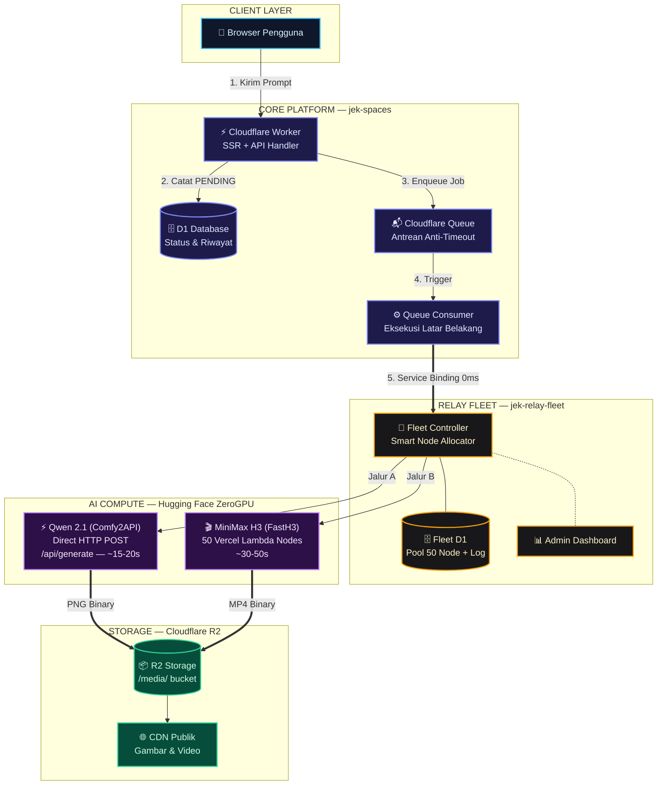
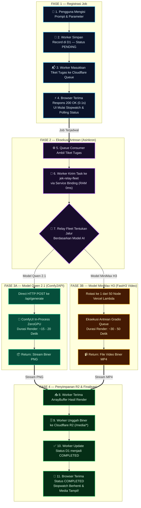

# 🏛️ ARSITEKTUR SISTEM JEK SPACES & JEK RELAY FLEET
> **Dokumentasi Resmi Arsitektur Produksi (The Golden Stack & Event-Driven Microservices)**  
> Terakhir diperbarui: 26 September 2026

---

## 📌 1. Ringkasan Eksekutif (Executive Summary)

Sistem **Jek Spaces** adalah platform generasi media AI (*Text-to-Image* dan *Text-to-Video*) berbasis **The Golden Stack** pada ekosistem Cloudflare Serverless:
* **Frontend & SSR:** React Router v7 (RRv7) + Tailwind CSS v4 + Cloudflare Workers Static Assets.
* **Database & ORM:** Cloudflare D1 (SQLite Distributed Edge Database) + Drizzle ORM.
* **Asynchronous Jobs:** Cloudflare Queues (Antrean terdistribusi anti-timeout).
* **Penyimpanan Media:** Cloudflare R2 Object Storage (Zero Egress Fees).
* **Inter-Worker Microservice:** Cloudflare Service Binding (Komunikasi in-memory RAM 0ms antar-Worker).
* **Microservice Armada Relay:** `jek-relay-fleet` (Gateway mandiri pengendali 50 node proxy AWS Lambda).
* **Mesin Inferensi AI:**
  1. **Qwen-Image 2.1 (T2I & Image Edit):** **Direct HTTP POST REST API** pada Hugging Face ZeroGPU (`/api/generate`) dengan pengembalian *Binary Media Stream* murni (~15–20 detik).
  2. **MiniMax-H3 / FastH3 (Video):** **50 Vercel Rotating Lambda Nodes** via antrean Gradio Queue untuk rotasi IP anti-kuota ZeroGPU.

---

## 🗺️ 2. Peta Arsitektur Tingkat Tinggi (Layered Architecture Topology)

Diagram topologi di bawah ini disusun dalam **5 Lapisan Vertikal Terstruktur (Top-Down)** untuk memudahkan pemahaman hierarki sistem tanpa garis yang saling bertumpuk:



---

## ⚡ 3. Alur Proses Langkah Demi Langkah (Step-by-Step Pipeline)

Berikut alur eksekusi generasi media AI dari awal sampai akhir, dibagi menjadi **4 Fase berurutan dari atas ke bawah**:



---

## 🔍 4. Bedah Peran Setiap Komponen (Deep Dive)

### 4.1 `jek-spaces` (Fullstack Web Application)
* **Direktori Proyek:** `c:\Users\sulta\Documents\cloudflare_worker\jek-spaces`
* **Domain Live:** `https://jek-spaces.jekverse.workers.dev`
* **Fungsi Utama:**
  1. Menyajikan UI responsif dengan dark-mode monokrom premium.
  2. Menerima request generasi dan menyimpannya ke D1 dengan status `PENDING`.
  3. Memasukkan task ke antrean `jek-spaces-video-queue`.
  4. Bertindak sebagai **Queue Consumer** di `workers/app.ts` untuk memproses tugas antrean di latar belakang.
  5. Menghubungi microservice `jek-relay-fleet` melalui **Cloudflare Service Binding** internal.
  6. Menyimpan hasil render biner secara permanen ke bucket R2 `jek-spaces-bucket`.

### 4.2 `jek-relay-fleet` (Fleet Controller Microservice)
* **Direktori Proyek:** `C:\Users\sulta\Documents\cloudflare_worker\jek-relay-fleet`
* **Domain Live:** `https://jek-relay-fleet.jekverse.workers.dev`
* **Fungsi Utama:**
  1. **Gateway Tunggal Pengiriman AI:** Menghadapi model heterogen (Direct REST vs Gradio Queue).
  2. **Smart Node Allocator:** Memilih node dari 50 proxy Vercel yang berstatus `ready` dan memiliki waktu istirahat terlama (*Fair Round-Robin*).
  3. **Manajemen Cooldown:** Menerapkan siklus *single-use cooldown* 15 menit per node setelah eksekusi sukses untuk mencegah pencekalan kuota ZeroGPU.
  4. **Telemetri & Audit Log:** Mencatat log aktivitas setiap inferensi (durasi render, IP egress, nama node, timestamp, status).
  5. **Admin Dashboard:** Tampilan visual dual-tab di `/dashboard` untuk memantau status 50 node dan log aktivitas live.

### 4.3 Cloudflare Service Binding (`RELAY_FLEET_SERVICE`)
* **Mengapa Sangat Penting?**
  * Di Cloudflare Workers, memanggil URL `https://*.workers.dev` milik Worker lain dalam akun yang sama menggunakan `fetch()` publik akan **diblokir otomatis oleh Cloudflare Loop Protection (HTTP 404)**.
  * Dengan mendaftarkan Service Binding di `wrangler.json`:
    ```json
    "services": [
      { "binding": "RELAY_FLEET_SERVICE", "service": "jek-relay-fleet" }
    ]
    ```
  * Request berjalan **in-memory di level RAM proses V8 runtime Cloudflare**.
  * **Latensi: 0 milidetik**, tidak melalui jaringan internet publik, dan 100% aman tanpa perlu mengekspos API publik.

### 4.4 Direct REST API vs Gradio Queue (Penjelasan Performa)

| Parameter | 🚀 Direct REST API (Qwen 2.1) | 🐢 Gradio Queue (Metode Lama / H3) |
| :--- | :--- | :--- |
| **Endpoint** | `POST /api/generate` | `/gradio_api/queue/join` + SSE `/queue/data` |
| **Kontrak Request** | JSON murni sederhana | Array array `data: [...]` yang kaku |
| **Kontrak Response** | **Binary Media Stream (`image/png`)** | Event stream bertingkat + URL unduhan galeri |
| **Overhead Protokol**| **Hampir 0 detik** | 5 – 15 detik (Join, 25 SSE progress event, download) |
| **Durasi Total** | **~15 – 20 detik** | **~35 – 50 detik** |
| **Alasan Kecepatan** | ComfyUI dieksekusi *in-process* langsung di GPU tanpa lapisan UI Gradio | Menunggu giliran worker Gradio, tqdm progress serialization, caching galeri |

---

## 📋 5. Spesifikasi Kontrak Data (API Contracts)

### 5.1 Request ke `POST /api/dispatch` (`jek-relay-fleet`)
Header wajib:
```http
Content-Type: application/json
X-Fleet-Secret: fleet_secret_jekverse_secure_2026
```
JSON Body:
```json
{
  "model": "qwen21",
  "prompt": "a futuristic cyberpunk street at night, neon reflections, 4k",
  "negativePrompt": "blurry, low quality, distorted",
  "aspectRatio": "16:9 (Widescreen)",
  "megapixels": 1.0,
  "steps": 25,
  "cfg": 1.0,
  "seed": 42891238,
  "batchCount": 1,
  "images": ["data:image/png;base64,..."],
  "generationId": "e4742891-aed0-49b1-a7ce-8a7e30859ed5"
}
```

### 5.2 Response dari `POST /api/dispatch`
Header kembalian:
```http
HTTP/1.1 200 OK
Content-Type: image/png
X-Node-Used: fasth3-relay-d4
X-Container-IP: Direct REST (ZeroGPU In-Process)
X-Elapsed-Seconds: 20.06
```
Body kembalian:
`ArrayBuffer` biner murni (1.5 MB – 2.0 MB stream PNG utuh).

---

## 🛠️ 6. Panduan Operasional & Pemecahan Masalah (Runbook)

### 6.1 Memantau Armada & Log Aktivitas
Buka dashboard kontrol armada secara langsung di browser:
👉 **[https://jek-relay-fleet.jekverse.workers.dev/dashboard](https://jek-relay-fleet.jekverse.workers.dev/dashboard)**
* **Tab Overview Armada:** Melihat status 50 node (Ready, Cooldown countdown live, total eksekusi).
* **Tab Log Aktivitas:** Melihat histori setiap generasi (durasi render per detik, status sukses/gagal, IP egress AWS).

### 6.2 Catatan DNS Windows (Wrangler IPv6 Timeout Workaround)
Pada beberapa jaringan Windows/router lokal, Node.js `undici` terkadang mengalami *hang* atau *read timeout* saat menghubungi `api.cloudflare.com` karena preferensi IPv6 DNS router.
Jika menjalankan perintah deploy manual di PowerShell, gunakan script preload DNS yang telah disediakan:
```powershell
$env:NODE_OPTIONS="--require C:\Users\sulta\.gemini\antigravity-ide\brain\3b3506e9-e080-45bd-9cb0-024e084afedc\scratch\preload-dns.cjs"
npx wrangler deploy
```

---

## 🏆 7. Kesimpulan

Arsitektur ini menggabungkan:
1. **Kecepatan:** Direct REST API memotong waktu render dari 45s menjadi **~15-20s**.
2. **Kestabilan:** Cloudflare Queues menjamin user tidak pernah mengalami halaman *timeout* atau *bad gateway*.
3. **Skalabilitas:** Microservice `jek-relay-fleet` memisahkan kompleksitas proxy dari aplikasi web utama.
4. **Efisiensi Biaya:** Cloudflare R2 membebaskan biaya *egress bandwidth*, memungkinkan ribuan gambar disajikan tanpa biaya tambahan.
